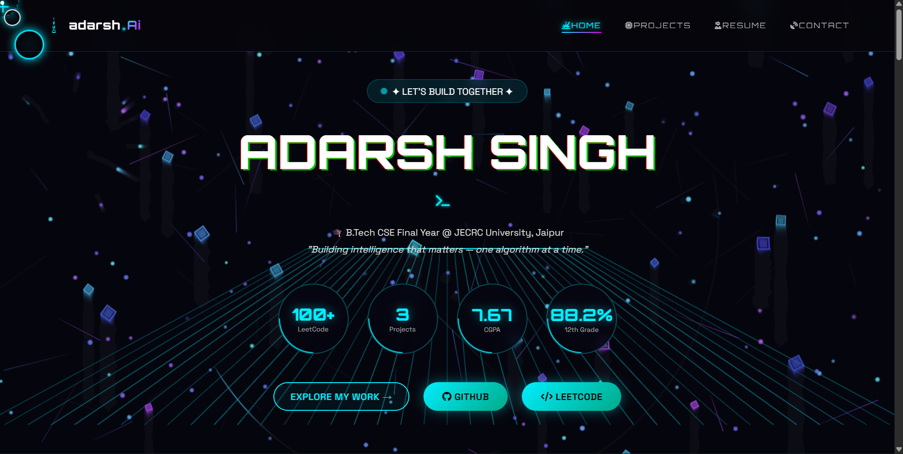
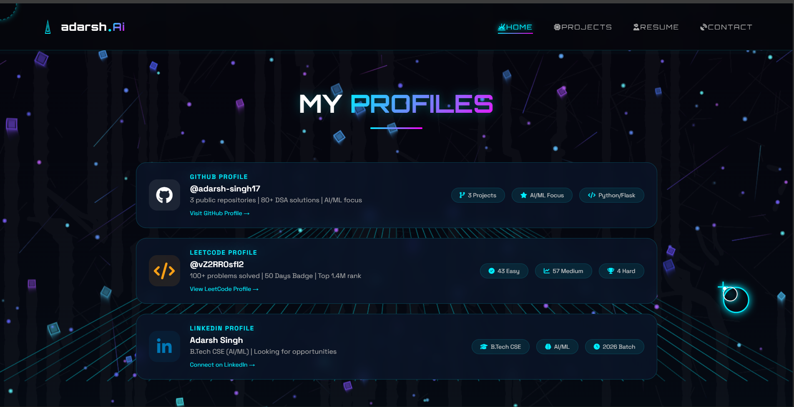
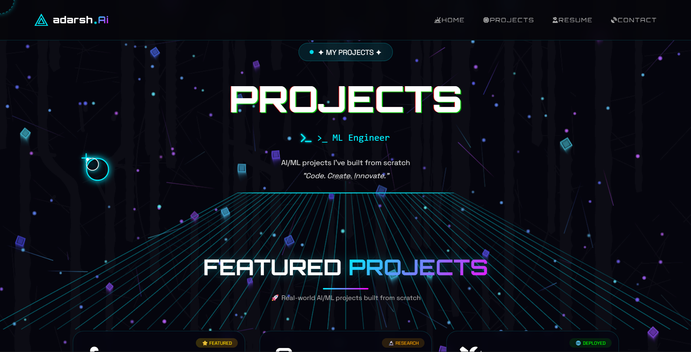
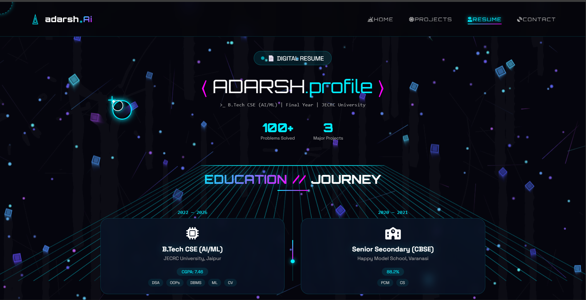

# 🚀 Adarsh Singh | AI/ML Engineer in Progress

> Turning imagination into intelligent systems ⚡

🌐 **Live Portfolio:** https://adarsh-portfolio.onrender.com

---

## 🧠 About Me

I am a **B.Tech CSE Final Year Student** passionate about building **real-world AI solutions and futuristic interfaces**.

I don’t just write code — I design **experiences that feel alive**.

* 💡 Interested in **AI, Automation & Voice Systems**
* 🤖 Building **VICTOR – AI Voice Assistant**
* 📊 Solved **100+ DSA problems (LeetCode)**
* 🚀 Exploring **Full-Stack + AI Integration**

---

## ✨ Portfolio Highlights

🔹 **Futuristic UI Design** – Neon + Glassmorphism based interface
🔹 **3D Neural Background** – Interactive particle system
🔹 **Custom Cursor System** – Target-lock animation
🔹 **Smooth Animations** – Scroll-based transitions
🔹 **Fully Responsive** – Mobile to Desktop

---
## 📸 Screenshots

### 🏠 Home Page

<p align="center">
  
</p>

---

### 🏠 Home Profile Page

<p align="center">
  
</p>

---

### 💼 Projects Page

<p align="center">
  
</p>

---

### 📄 Resume Page

<p align="center">
  
</p>


## 🛠️ Tech Stack

### 👨‍💻 Languages

* Python
* C++
* JavaScript

### 🌐 Web Development

* Flask
* HTML5
* CSS3

### 🎨 UI/UX

* Glassmorphism
* Neumorphism
* Custom Animations

### ⚙️ Tools

* Git & GitHub
* VS Code
* Render / PythonAnywhere

---

## 📂 Project Structure

```
Portfolio/
│── app.py
│── requirements.txt
│── README.md
│
├── static/
│   ├── style.css
│   └── images/
│
└── templates/
    ├── base.html
    ├── index.html
    ├── projects.html
    ├── resume.html
    └── contact.html
```

---

## 🚀 Key Features

### 🎯 Custom Cursor

* Neon target lock animation
* Particle trail system
* Hover interactions

### 🌌 Background System

* Neural network animation
* 3D grid + floating elements
* Radar scan effect

### 📱 Responsive Design

* Mobile-first layout
* Smooth navigation
* Adaptive UI

---

## 🔧 Installation

```bash
git clone https://github.com/adarsh-singh17/Portfolio.git
cd Portfolio

python -m venv venv
venv\Scripts\activate   # Windows

pip install -r requirements.txt
python app.py
```

👉 Open: http://127.0.0.1:5000

---

## 🌐 Deployment

### Render

* Build: `pip install -r requirements.txt`
* Start: `gunicorn app:app`

---

## 📊 Achievements

* 💻 100+ LeetCode Problems
* 📂 80+ DSA Implementations
* 🚀 Multiple AI/ML Projects
* 🎯 Strong focus on real-world applications

---

## 📬 Connect With Me

* GitHub: https://github.com/adarsh-singh17
* LinkedIn: Adarsh Singh
* LeetCode: vZ2RR0sfI2

---

## ⚡ Vision

> Building AI systems that don’t just respond — they understand.

---

## ⭐ Support

If you like this project, give it a ⭐ — it motivates me to build more!

---

**Built with ❤️ by Adarsh Singh**
